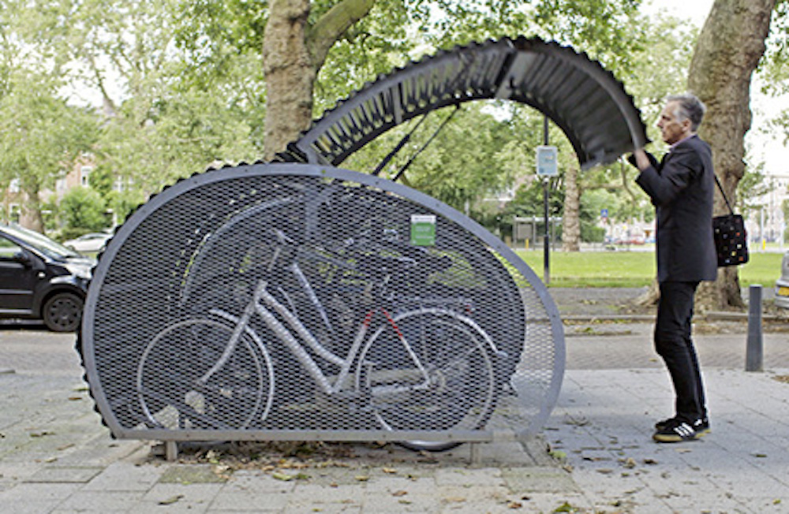

Biclò è l'unico distributore italiano di Fietshangar, l'originale bikebox olandese progettato per le strade di Rotterdam nei primi anni '90.
Con 30+ anni di esperienza, Fietshangar è la soluzione più efficace per garantire la sicurezza e il confort della tua bici.

  <a href="https://www.fietshangar.com" target="_blank" class="btn btn-lg btn-secondary fw-bold border-white bg-white">Vai al sito di Fietshangar</a>

 

Biclò offre le Biclostazioni™ ai soci-utenti del <a href="/network">Network Biclò</a> ma anche a società, condomini, enti locali o privati che abbiano bisogno di offrire soluzioni di parcheggio sicuro ai loro propri soci, utenti, condomini, o familiari.

Tutte le Biclostazioni™ arrivano dotate di lucchetto elettronico con tecnologia EVVA e possono essere aperte con l'<a href="/app">App Biclò</a>.

 Se ti interessa acquistare una Biclostazione™ contattaci!   <a href="mailto:info@biclo.it!" target="_blank" class="mt-3 btn btn-lg btn-secondary fw-bold border-white bg-white">Scrivi a info@biclo.it!</a> 
