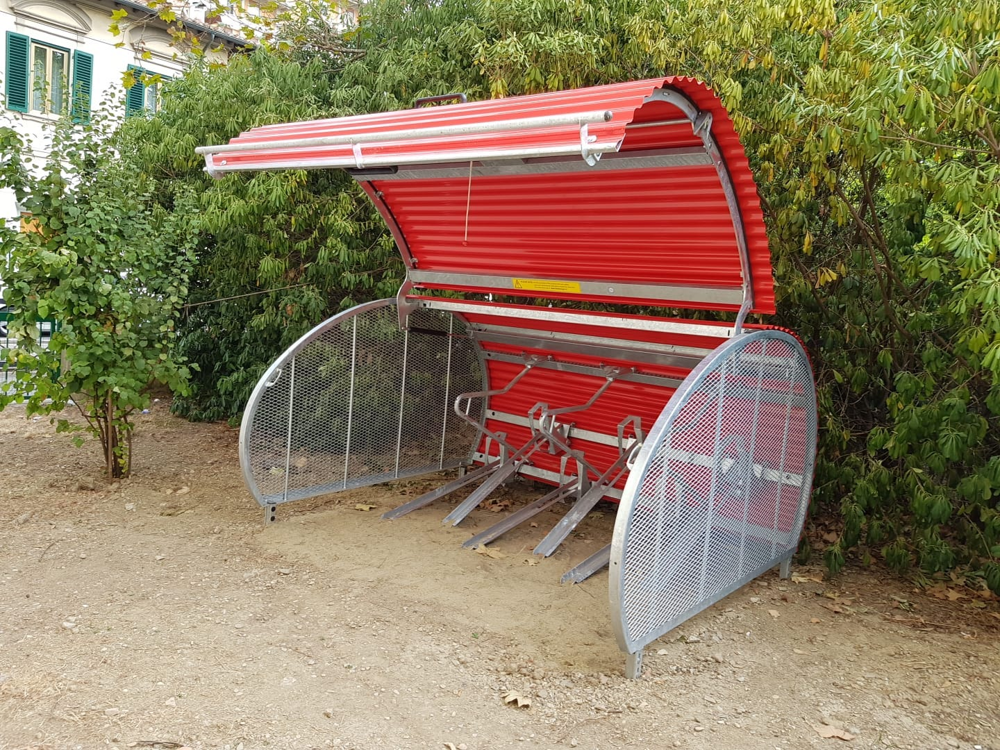

La Biclorete è il network di Biclostazioni gestita direttamente da Biclò, dedicata direttamente ai cittatini-ciclisti.

Il progetto è stato attivato per la prima volta nell'Ottobre 2023 a Firenze, presso l'SMS Rifredi, in Via Vittorio Emanuele 303.

La sperimentazione prevede l'attivazione di una Biclostazione™ pilota con i primi 6 utenti, ma presto ne attiveremo altre. 

Fai sentire la tua voce! Se anche tu vuoi una Biclostazione™ nella tua zona, contattaci!

 <a href="mailto:info@biclo.it!" target="_blank" class="btn btn-lg btn-secondary fw-bold border-white bg-white">Scrivi a info@biclo.it!</a> 

